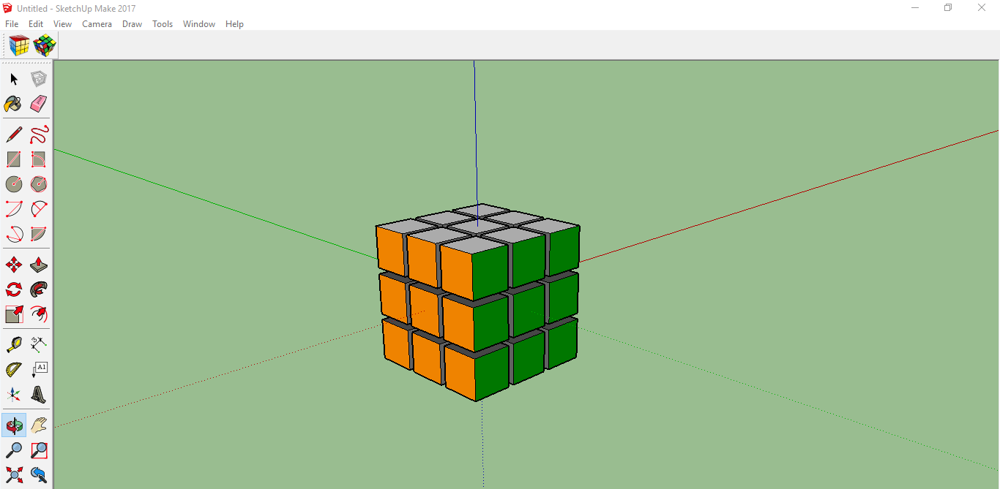
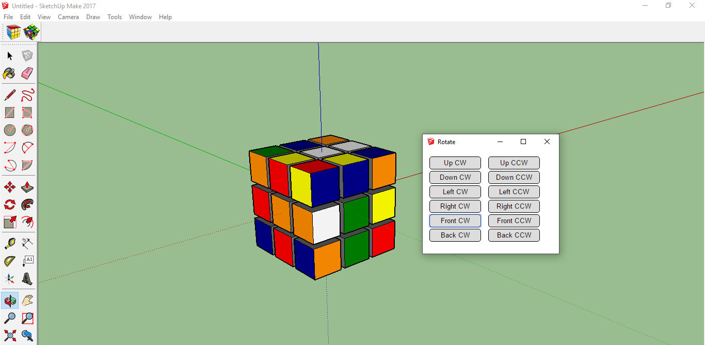

# README
## Description
Script for creating and manipulating Rubix Cube inside Sketchup.




## Installation

First you need to install [SketchUp](https://www.sketchup.com/plans-and-pricing#for-personal).

To install the Rubix Cube, copy folder ```rubix_cube``` and file ```rubix_cube.rb``` inside Sketchup Plugins folder, which can be found (on Windows) on similar filepath:
```C:\Users\User1\AppData\Roaming\SketchUp\SketchUp 2017\SketchUp\Plugins```.
## Running
When SketchUp is started, Rubix Cube toolbar will appear. A click on left icon will create cube in origin of cordinate system. Click on right icon will open the dialog with buttons for rotating parts of cube.
